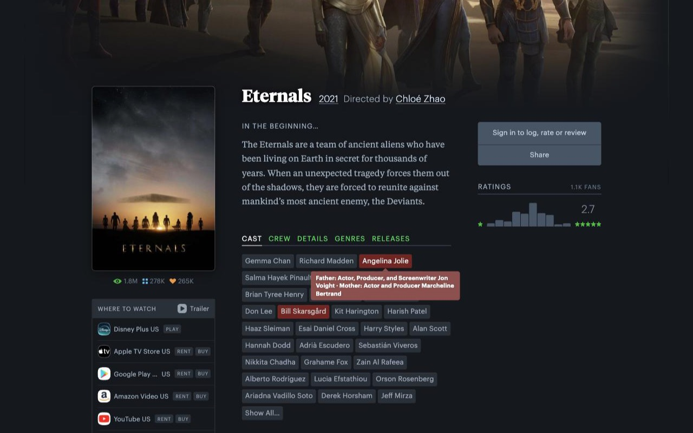

# Nepo Baby Detector for Letterboxd

Browser extension (Chrome and Firefox) that flags actors on Letterboxd
who have a notable parent, using the dataset from
[nepo-babies-scraper](https://github.com/SomeLikeItChott/nepo-babies-scraper).

This product uses the TMDB API but is not endorsed or certified by TMDB.

| Cast list badge + tooltip | Actor page banner |
| --- | --- |
|  |  |

## Install

```sh
npm install
npm run build-data   # downloads the latest published dataset
npm run build         # compiles src/content.ts -> dist/content.js
```

Then load it unpacked:

- **Chrome**: `chrome://extensions` → enable Developer Mode → **Load
  unpacked** → select this directory.
- **Firefox**: `about:debugging#/runtime/this-firefox` → **Load
  Temporary Add-on…** → select `manifest.json` in this directory.

## How it works

- **Film pages**: cast members with a notable parent get a highlighted
  badge and a hover tooltip naming the parent.
- **Actor pages**: a banner appears under the actor's name if they
  match, linking to each parent's Letterboxd or Wikipedia page.
- Data is cached locally and refreshed from the scraper's published
  dataset at most once a week, in the background — never blocks page
  rendering, and falls back to the cached copy if a refresh fails.

## Limitations

- Inherits the scraper's limitations — see its README.
- Manifest V3; works in both Chrome and Firefox (113+).
- Father/mother relations only, no siblings or wider family.
